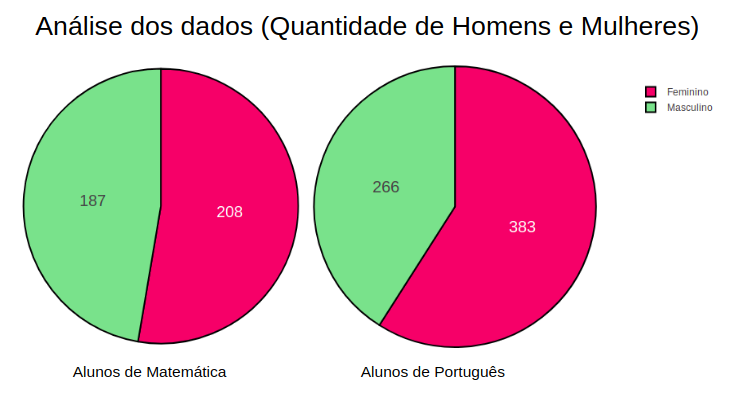

# Student Alcohol
Student Alcohol Consumption data science

[Dataset](https://www.kaggle.com/uciml/student-alcohol-consumption)

<!--O trabalho foi desenvolvido com o objetivo de explicitar o consumo de bebidas alcolicas entre estudantes e relacionar o seu desempenho academico e problemas familiares que o alcool.-->

# Motivação
  Com o aumento crescente do consumo de álcool entre os jovens, e a facilidade para se obter bebidas, muitos jovem vem buscando uma maneira de contornar os dificuldades diárias e problemas familiares com o consumo de bebidas alcoólicas.

# Grupo 
* **Nome:** André Luiz **E-mail:** andre_llm@hotmail.com
* **Nome:** Eulle Araújo **E-mail:**  eulle100@gmail.com
* **Nome:** Fernando Maciel **E-mail:** nandormaciel@gmail.com
* **Nome:** Luís Andrade **E-mail:** luisandrade_araujo@hotmail.com

# Tecnologias utilizadas
* Pandas
* Numpy
* Matplotlib
* Plotly

# Iniciando as análises 

## Análise dos dados (Quantidade de Homens e Mulheres)

## Análise dos dados ( Distribuição da idade dos alunos )
**Alunos de Matemática**

**Alunos de Portugues**

## Consumo de bebida alcoólica nos dias de trabalho (IDADE)
**Alunos da turma de Matemática + Alunos da Turma de Português**

## Consumo de bebida alcoólica nos finais de semana (IDADE)
**Alunos da turma de Matemática + Alunos da Turma de Português**

## Consumo de bebida alcoólica nos dias de trabalho (SEXO)
**Alunos da turma de Matemática + Alunos da Turma de Português**

## Consumo de bebida alcoólica nos finais de semana (SEXO)
**Alunos da turma de Matemática + Alunos da Turma de Português**

## Problemas encontrados
* Os alunos não possuem identificador 
* Pequeno número amostral

